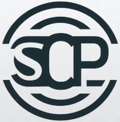

<!-- README.md is generated from README.Rmd. Please edit that file -->

# ODPSCP

<!-- badges: start -->

<!-- badges: end -->

The goal of the ODPSCP framework is to provide a reproducible and easy
to create reporting standard for systematic conservation planning
studies. The abbrevation stands for *O*verview and *D*esign *P*rotocol
for *S*ystematic *C*onservation *P*lanning, but can equally be
understood as abbreviations for its individual elements (Overview,
Design, Specification, Contextualization, Planning). The protocol
follows other reporting framework such
[ODMAP](https://onlinelibrary.wiley.com/doi/10.1111/ecog.04960) or
[ODD](https://www.jasss.org/23/2/7.html).

This repository contains the shiny app behind the package and can be
visualized on \[INSERT\] where it will remain hosted. The code has been
created with the help of the *golem* framework for production- ready
shiny interfaces. Further versions of the framework are planned.

Please note that the ODPSCP project is released with a [Contributor Code
of
Conduct](https://contributor-covenant.org/version/2/1/CODE_OF_CONDUCT.html).
By contributing to this project, you agree to abide by its terms.
