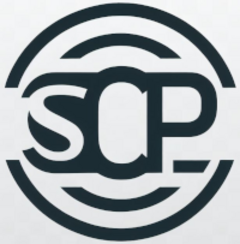

<!-- README.md is generated from README.Rmd. Please edit that file -->

# ODPSCP 

<!-- badges: start -->

[](https://lifecycle.r-lib.org/articles/stages.html#experimental)
[](https://martinjung.shinyapps.io/ODPSCP/)

<!-- badges: end -->

The goal of the ODPSCP framework is to provide a reproducible and easy
to create reporting standard for systematic conservation planning
studies. The abbreviation stands for *O*verview and *D*esign *P*rotocol
for *S*ystematic *C*onservation *P*lanning, but can equally be
understood as abbreviations for its individual elements (Overview,
Design, Specification, Context, Prioritization). The protocol follows
other reporting framework such
[ODMAP](https://onlinelibrary.wiley.com/doi/10.1111/ecog.04960) or
[ODD](https://www.jasss.org/23/2/7.html).

## Availability

This repository contains the shiny app behind the package and can be
visualized on <https://odpscp.iiasa.ac.at/> where it will remain hosted.
A full list of known mirrors can be found here:

| Host | Url | Comment |
|----|----|----|
| IIASA | <https://odpscp.iiasa.ac.at/> | Official host website |
| Shinyapps (Martin Jung) | <https://martinjung.shinyapps.io/ODPSCP/> | Secondary mirror |
|  |  |  |

If you plan to host a mirror of the shiny app, please let
[Martin](https://github.com/Martin-Jung) know for example via an issue
so that it can be added to the table. Hosting a mirror improves the
long-term resilience of the platform. Institutional logos and branding
are welcome as long as the protocol is consistent with the ODPSCP
standard.

## Installation and execution

It is also possible to run the shiny-interface locally. To do so, you
need to install the package from GitHub:

``` r
# install.packages("devtools")
devtools::install_github("iiasa/ODPSCP")

library(ODPSCP)

# Run the application
ODPSCP::run_app()
```

## Contribution

The code is open source and contributions are welcome. The code is
licensed under the [CC-BY
4.0](https://creativecommons.org/licenses/by/4.0/). The interface has
been created in *R-shiny* with the help of the *golem* framework for
production- ready shiny interfaces. It uses Further versions of the
framework are planned and we welcome suggested pull requests and edits
by the SCP community.

Please note that the ODPSCP project is released with a [Contributor Code
of
Conduct](https://contributor-covenant.org/version/2/1/CODE_OF_CONDUCT.html).
By contributing to this project, you agree to abide by its terms.
